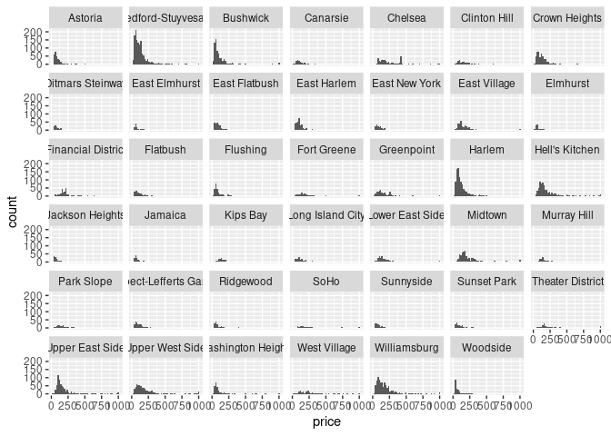

HW 01 - Airbnb listings in NYC
================
Jonathan Klus
4 September 2021

## Load packages and data

``` r
library(tidyverse)
nycbnb = read_csv("https://urmc-bst.github.io/bst430-fall2021-site/hw_lab_instruction/hw-01-airbnb/data/nylistings.csv")
```

## Exercises

### Exercise 1

*How many observations (rows) does the dataset have? Instead of hard
coding the number in your answer, use inline code.*

``` r
nrow(nycbnb)
```

    ## [1] 12773

The data set has 12773 observations.

### Exercise 2

*Run `View(nycbnb)` in your Console to view the data in the data viewer.
What does each row in the dataset represent?*

Each row represents a single Airbnb property in New York City.

### Exercise 3

*Create a faceted histogram where each facet represents a neighborhood
and displays the distribution of Airbnb prices in that neighborhood.
Think critically about whether it makes more sense to stack the facets
on top of each other in a column, lay them out in a row, or wrap them
around. Along with your visualisation, include your reasoning for the
layout you chose for your facets.*

``` r
ggplot(data = nycbnb, mapping = aes(x = price)) +
  geom_histogram(binwidth = 20) +
  facet_wrap( . ~ neighborhood) # or facet_grid...
```

<!-- -->

### Exercise 4

Remove this text, and add your answer for Exercise 4 here.

``` r
# remove this comment and add the code for Exercise 4 here
```

``` r
# remove this comment and add the code for Exercise 4 here
```

``` r
# remove this comment and add the code for Exercise 4 here
```

### Exercise 5

Remove this text, and add your answer for Exercise 5 here.

``` r
# remove this comment and add the code for Exercise 5 here
```

### Exercise 6

``` r
# remove this comment and add code for Ex 6
```

### Exercise 7

Remove this text and add your answer for Ex 7

### Exercise 8 (**extra credit**)

Remove this text and add your answer for Ex 8

``` r
#remove this comment and add code for Ex 8
```
